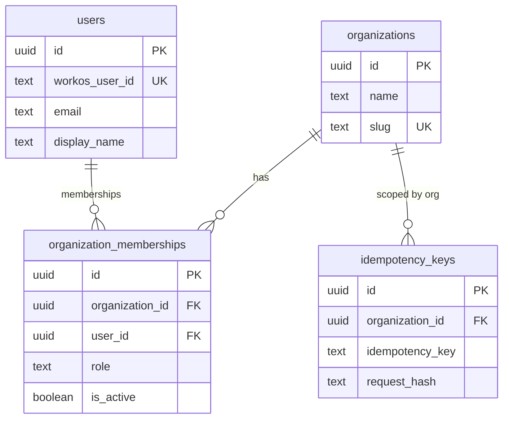

# ADR-0001: Tenancy, RLS, and Database Roles

**Status:** Proposed

## Context

Accord is a greenfield multi-tenant payroll SaaS for local governments. Unlike Atlas (single-tenant, one deployment per customer), a single Accord deployment hosts many organizations. A tenancy bug is a full data-breach class failure: one municipality must never read or mutate another’s employees, bank accounts, or payroll runs.

PostgreSQL Row Level Security (RLS) is a **forced, mandatory** tenancy control for Accord — not optional defense-in-depth. Application filters alone are insufficient: a missing `WHERE organization_id = …` in one query would leak rows. RLS must deny cross-tenant access even if application code forgets to filter.

We also need:

1. An explicit multi-organization data model with `organization_id` on every tenant-owned table.
2. Composite foreign keys / unique constraints that include `organization_id`, so joins cannot silently cross tenants.
3. Transaction-local tenant context that is safe with pooled async connections (asyncpg / SQLAlchemy).
4. Separated database roles: migration owner vs runtime API vs background workers.
5. An invariant that clients never supply organization scope for read/write authorization.
6. A testing strategy that proves isolation under the runtime role.

Related: [0002-workos-authentication-sessions.md](0002-workos-authentication-sessions.md), [0004-organization-url-session-context.md](0004-organization-url-session-context.md).

## Decision

### 1. Explicit multi-organization data model

- Every tenant-owned table carries `organization_id uuid NOT NULL` referencing `organizations(id)`.
- Child tables use **composite foreign keys** that include `organization_id` alongside the parent natural/surrogate key, so a child row cannot reference a parent in another organization.
- Natural-key uniqueness is always scoped: `UNIQUE (organization_id, …)`.
- `users` is **tenant-independent**: a person may belong to multiple organizations via `organization_memberships`. User identity is not an organization-owned row.

Representative DDL:

```sql
CREATE TABLE organizations (
  id          uuid PRIMARY KEY,
  name        text NOT NULL,
  slug        text NOT NULL UNIQUE,
  created_at  timestamptz NOT NULL DEFAULT now()
);

CREATE TABLE users (
  id              uuid PRIMARY KEY,
  workos_user_id  text NOT NULL UNIQUE,
  email           text NOT NULL,
  display_name    text NOT NULL,
  created_at      timestamptz NOT NULL DEFAULT now()
);

CREATE TABLE organization_memberships (
  id               uuid PRIMARY KEY,
  organization_id  uuid NOT NULL REFERENCES organizations (id),
  user_id          uuid NOT NULL REFERENCES users (id),
  role             text NOT NULL,
  is_active        boolean NOT NULL DEFAULT true,
  created_at       timestamptz NOT NULL DEFAULT now(),
  UNIQUE (organization_id, user_id)
);

CREATE TABLE idempotency_keys (
  id               uuid PRIMARY KEY,
  organization_id  uuid NOT NULL REFERENCES organizations (id),
  idempotency_key  text NOT NULL,
  request_hash     text NOT NULL,
  response_status  integer,
  response_body    jsonb,
  created_at       timestamptz NOT NULL DEFAULT now(),
  UNIQUE (organization_id, idempotency_key)
);

-- Example child table: composite FK prevents cross-tenant parent reference
CREATE TABLE employees (
  id               uuid PRIMARY KEY,
  organization_id  uuid NOT NULL REFERENCES organizations (id),
  sevarth_id       text NOT NULL,
  UNIQUE (organization_id, sevarth_id)
);

CREATE TABLE employee_bank_accounts (
  id               uuid PRIMARY KEY,
  organization_id  uuid NOT NULL,
  employee_id      uuid NOT NULL,
  account_number   text NOT NULL,
  UNIQUE (organization_id, employee_id, account_number),
  FOREIGN KEY (organization_id, employee_id)
    REFERENCES employees (organization_id, id)
);
```

### 2. Forced Row Level Security (mandatory)

Every organization-owned table enables **and forces** RLS in its **first** migration that creates the table — never bolted on later:

```sql
ALTER TABLE organization_memberships ENABLE ROW LEVEL SECURITY;
ALTER TABLE organization_memberships FORCE ROW LEVEL SECURITY;

ALTER TABLE idempotency_keys ENABLE ROW LEVEL SECURITY;
ALTER TABLE idempotency_keys FORCE ROW LEVEL SECURITY;

ALTER TABLE employees ENABLE ROW LEVEL SECURITY;
ALTER TABLE employees FORCE ROW LEVEL SECURITY;

-- Repeat for every tenant-owned table at creation time.
```

`FORCE ROW LEVEL SECURITY` ensures even the table owner is subject to RLS (the migration-owner role uses `BYPASSRLS` or a separate privilege path for DDL/migrations; see roles below). Runtime roles never bypass RLS.

**Policy pattern** (tenant isolation via transaction GUCs):

```sql
CREATE POLICY tenant_isolation ON employees
  FOR ALL
  TO accord_app
  USING (
    organization_id = NULLIF(current_setting('app.organization_id', true), '')::uuid
  )
  WITH CHECK (
    organization_id = NULLIF(current_setting('app.organization_id', true), '')::uuid
  );
```

Behavior when the setting is unset:

- `current_setting('app.organization_id', true)` returns `NULL` when missing (the `true` argument means “missing OK”).
- `NULLIF(..., '')::uuid` yields `NULL`.
- The predicate `organization_id = NULL` is never true for a real UUID row → **SELECT/UPDATE/DELETE return zero rows** (fail closed).
- `WITH CHECK` rejects INSERT/UPDATE when the cast/setting is NULL or when the row’s `organization_id` does not match → **writes fail closed**.

Apply an equivalent `tenant_isolation` policy (or per-command policies) on every tenant-owned table for the runtime and worker roles.

### 3. Transaction-local context (`SET LOCAL`)

Immediately after acquiring a connection/transaction for a tenant-scoped request — and **before** any tenant query — the application issues:

```sql
SET LOCAL app.organization_id = '11111111-1111-1111-1111-111111111111';
SET LOCAL app.user_id = '22222222-2222-2222-2222-222222222222';
SET LOCAL app.request_id = 'a1b2c3d4e5f6789012345678abcdef01';
```

Python sketch (SQLAlchemy async session / connection):

```python
async def bind_tenant_context(
    connection,
    *,
    organization_id: str,
    user_id: str,
    request_id: str,
) -> None:
    await connection.execute(
        text("SELECT set_config('app.organization_id', :org, true)"),
        {"org": organization_id},
    )
    await connection.execute(
        text("SELECT set_config('app.user_id', :uid, true)"),
        {"uid": user_id},
    )
    await connection.execute(
        text("SELECT set_config('app.request_id', :rid, true)"),
        {"rid": request_id},
    )
```

`SET LOCAL` / `set_config(..., is_local=true)` is **required** instead of session-scoped `SET` because Accord uses a pooled async engine (asyncpg + SQLAlchemy). Connections are reused across requests. A leaked session-scoped `app.organization_id` from tenant A would remain on the connection when tenant B’s request checks out the same connection — a silent cross-tenant context leak. Transaction-local settings reset when the transaction ends, so the next checkout starts clean.

### 4. Database roles

Three roles, created in an early migration / ops bootstrap:

```sql
-- Owns schema/tables; runs Alembic; may bypass RLS for DDL/data migrations.
CREATE ROLE accord_migrator WITH
  LOGIN
  PASSWORD /* from secrets manager — never committed */
  NOSUPERUSER
  NOCREATEDB
  NOCREATEROLE
  BYPASSRLS;

-- Runtime API role: RLS always applies; DML only; does not own tables.
CREATE ROLE accord_app WITH
  LOGIN
  PASSWORD /* from secrets manager */
  NOSUPERUSER
  NOBYPASSRLS
  NOCREATEDB
  NOCREATEROLE;

-- Background workers / jobs: same RLS constraint; narrower grants as needed.
CREATE ROLE accord_worker WITH
  LOGIN
  PASSWORD /* from secrets manager */
  NOSUPERUSER
  NOBYPASSRLS
  NOCREATEDB
  NOCREATEROLE;

-- Ownership and grants (illustrative)
ALTER TABLE employees OWNER TO accord_migrator;
GRANT SELECT, INSERT, UPDATE, DELETE ON TABLE employees TO accord_app;
GRANT SELECT, INSERT, UPDATE, DELETE ON TABLE employees TO accord_worker;

-- Prefer granting on a schema or via future table groups; never GRANT BYPASSRLS
-- or ownership to accord_app / accord_worker.
GRANT USAGE ON SCHEMA public TO accord_app, accord_worker;
```

| Role | Purpose | RLS |
| --- | --- | --- |
| `accord_migrator` | Alembic / DDL / controlled data migrations (`MIGRATIONS_DATABASE_URL`) | May `BYPASSRLS` for migration tooling only |
| `accord_app` | FastAPI request path (`DATABASE_URL`) | Always subject to RLS (`NOBYPASSRLS`) |
| `accord_worker` | Background jobs | Always subject to RLS; grants may be narrower than API |

Runtime and worker DSNs must never use the migrator credentials (see [0003-backend-bootstrap-environment.md](0003-backend-bootstrap-environment.md)).

### 5. Invariant: organization scope is never client-supplied

A request body **must never** carry `organization_id` (or equivalent organization scope) as trusted input for read/write scoping. Organization is resolved **server-side** from the authenticated session’s active organization (and URL only in the narrow cases in [0004-organization-url-session-context.md](0004-organization-url-session-context.md)).

Rules:

- Tenant-owned create/update payloads that include `organization_id` are **ignored or rejected** (prefer reject with 422 Problem Detail in Phase 1) — never honored over session context.
- Handlers stamp `organization_id` from session/middleware before INSERT.
- RLS `WITH CHECK` is the last line of defense if application code is wrong.

### 6. Testing strategy (direct SQL as runtime role)

RLS tests connect **as `accord_app`** (or a test clone of that role), never as a superuser / migrator with `BYPASSRLS`.

Minimum assertions:

1. **Cross-tenant read/update/delete isolation:** seed a row for org A; set `app.organization_id` to org B; `SELECT`/`UPDATE`/`DELETE` affecting that row returns **zero rows** even though the row exists when queried as migrator.
2. **Mismatched INSERT rejected:** with `app.organization_id = A`, `INSERT` with `organization_id = B` fails `WITH CHECK`.
3. **Cross-tenant matrix:** seed N ≥ 2 organizations with overlapping natural keys (same `sevarth_id`, same idempotency key string, etc.). For every tenant-owned table, a parameterized test binds each org’s context and asserts it sees only its own rows. Prefer one generic/parameterized harness over one hand-written test per table where feasible.

```sql
-- Shape of a direct-SQL isolation check
SET ROLE accord_app;
SELECT set_config('app.organization_id', :org_b, true);

SELECT count(*) FROM employees WHERE id = :employee_in_org_a;
-- expect 0

UPDATE employees SET sevarth_id = 'x' WHERE id = :employee_in_org_a;
-- expect 0 rows updated

INSERT INTO employees (id, organization_id, sevarth_id)
VALUES (gen_random_uuid(), :org_a, 'overlap-key');
-- expect failure (WITH CHECK) when GUC is org_b
```

### 7. Entity-relationship sketch



Notes:

- `users` has **no** `organization_id`; multi-org membership is only via `organization_memberships`.
- `idempotency_keys` is per-organization with composite unique `(organization_id, idempotency_key)`.
- India-specific locale, timezone, currency, and financial-year conventions are
  application invariants, not tenant settings. The former
  `organization_settings` table was retired in revision `d1c7a2e9f4b6`.

## Consequences

- Tenant isolation is enforced in PostgreSQL for every tenant-owned table from day one; forgetting an application `WHERE` clause cannot leak rows across orgs when context is bound correctly.
- Connection pooling is safe only if every tenant path uses `SET LOCAL` / local `set_config` and never session-scoped GUCs.
- Ops must maintain two DSNs (migrator vs app) and never point the API at a `BYPASSRLS` role.
- Composite FKs increase migration discipline (parent uniqueness must include `organization_id`) but eliminate an entire class of cross-tenant join bugs.
- Direct-SQL RLS tests become a release gate for schema changes that add tenant-owned tables.
- Application authors must treat `organization_id` in request bodies as hostile/untrusted.

## Alternatives Considered

1. **Application-only filters (no RLS)** — Rejected. One missed predicate is a cross-tenant breach; unacceptable for multi-org government payroll.
2. **RLS without FORCE** — Rejected. Table owners and privileged connections can accidentally bypass policies; `FORCE ROW LEVEL SECURITY` closes that gap for non-bypass roles.
3. **Session-scoped `SET app.organization_id`** — Rejected. Unsafe with asyncpg/SQLAlchemy connection pools; context can leak across requests.
4. **Separate database/schema per tenant** — Deferred/rejected for Phase 0. Operationally heavy for many municipalities; RLS + shared schema is the chosen multi-tenant model.
5. **Trust `organization_id` from JSON body** — Rejected. Enables IDOR via body tampering; session/server resolution is mandatory (see ADR 0004).
