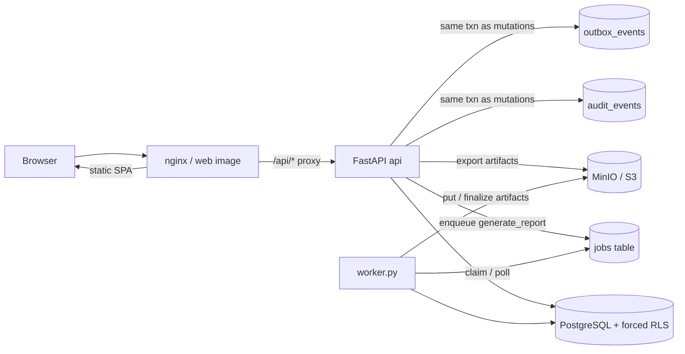
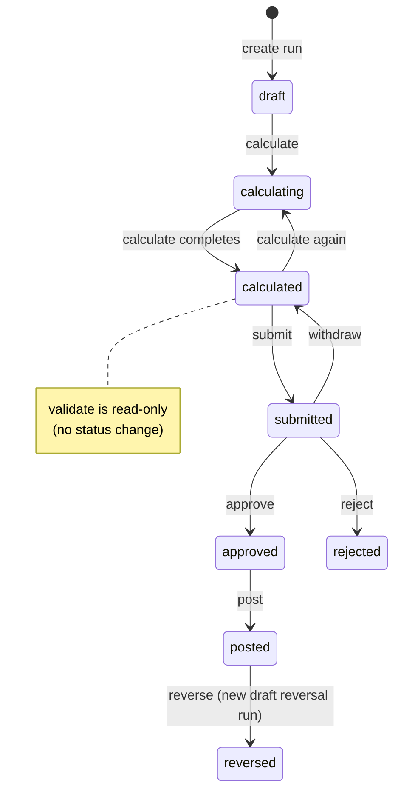

# Accord architecture

Concise runtime and workflow map for operators and contributors. Normative
decisions live in ADRs under [`adr/`](adr/); this document only summarizes
verified code paths and notes where implementation differs from ADR text.

---

## Component diagram



- **web**: `deploy/Dockerfile.web` builds the frontend and serves via
  `deploy/nginx/nginx.conf` (static + `/api` proxy).
- **api**: `backend/app/main.py` (uvicorn); Compose service `api`.
- **worker**: `backend/worker.py` (`python worker.py`); Compose service
  `worker` polls the PostgreSQL jobs queue (ADR 0010).
- **audit / outbox**: written in the same DB transaction as posting and other
  mutating commands (ADR 0009); see `backend/app/services/run_posting.py`.

---

## Pay-run command workflow (as implemented)

Persisted statuses (from `run_workflow.py` module docstring and services):
`draft`, `calculating`, `calculated`, `submitted`, `approved`, `rejected`,
`posted`, `reversed`.



| Command | Module | Transition |
| --- | --- | --- |
| `calculate` | `services/run_calculation.py` | `draft`\|`calculated` → `calculating` → `calculated` |
| `validate` | `services/run_workflow.py` | read against `calculated` only; no status change |
| `submit` | `services/run_workflow.py` | `calculated` → `submitted` |
| `withdraw` | `services/run_workflow.py` | `submitted` → `calculated` |
| `approve` / `reject` | `services/run_workflow.py` | `submitted` → `approved` / `rejected` |
| `post` | `services/run_posting.py` | `approved` → `posted` (+ audit + outbox) |
| `reverse` | `services/run_posting.py` | `posted` → `reversed`; creates a new `draft` reversal run |

**Discrepancies vs ADR 0008 (do not paper over):**

- ADR lists statuses `validated` and `withdrawn`; code has neither. Validate
  does not set a status; withdraw lands on `calculated`.
- ADR allows `calculate` from `rejected`; code allows only `draft` and
  `calculated` (`_ALLOWED_CALCULATE_STATUSES`).
- ADR allows `withdraw` from `approved`; code allows only `submitted`.
- Code adds transient `calculating` during calculate (not in the ADR closed set).

---

## Request tenancy flow

Verified against `backend/app/api/deps.py`, `backend/app/tenancy.py`,
`backend/app/services/identity.py`, ADR 0001, ADR 0004:

1. **Session** — WorkOS-backed session cookie establishes the principal
   (`get_current_user` → `AuthPrincipal` with optional
   `active_organization_id`).
2. **Membership** — `require_tenant_context` requires an active org on the
   principal, loads the user, then `resolve_active_organization` re-checks
   membership under RLS.
3. **SET LOCAL** — before membership re-check, `bind_tenant_context` issues
   `set_config(..., is_local=true)` for `app.organization_id`, `app.user_id`,
   and optional `app.request_id` (transaction-local; safe with asyncpg pooling).
4. **RLS** — tenant tables use forced row-level security keyed on those GUCs
   (ADR 0001). Missing context fail-closes.

Workers bind org context after claiming a job (`jobs/worker.py` →
`bind_tenant_context`).

---

## Report pipeline

Verified against `backend/app/reports/`, `backend/app/services/report_generation.py`,
`backend/app/services/artifacts.py`, `backend/app/api/routes/artifacts.py`:

1. **Registry** — `reports/registry_setup.py` `build_report_registry()` registers
   all first-release families (payroll register, payments, retirement, statutory,
   recovery, approval note).
2. **Request** — API enqueues `generate_report` via `request_report` (org-scoped
   in-flight dedupe on type/run/format/template).
3. **Builder** — worker handler `execute_generate_report` loads the registration
   builder against a **posted** run snapshot → `ReportDTO`.
4. **Formatter** — `to_json` / `to_excel` / `to_pdf` on the registration.
5. **Artifact** — `create_artifact` pending → storage put → finalize
   (`ExportArtifact`); may reuse an existing finalized artifact.
6. **Download** — `GET /api/artifacts/{id}/download` streams bytes through the
   API with org/capability checks (`artifacts.py`).

Reports never re-resolve “current” master data; they read posted pinned versions
(see [`report-specs/report-catalog.md`](report-specs/report-catalog.md)).

---

## ADR index (one-line each)

| ADR | Summary |
| --- | --- |
| [0001](adr/0001-tenancy-rls-database-roles.md) | Forced RLS, DB roles (`accord_migrator` / `accord_app` / `accord_worker`), GUC tenant context |
| [0002](adr/0002-workos-authentication-sessions.md) | WorkOS auth, sessions, capabilities |
| [0003](adr/0003-backend-bootstrap-environment.md) | Backend bootstrap and environment settings matrix |
| [0004](adr/0004-organization-url-session-context.md) | Active org on session/URL; central SET LOCAL binding |
| [0005](adr/0005-effective-dated-master-data.md) | Effective-dated master versions; pin on post |
| [0006](adr/0006-money-decimal-rounding.md) | Decimal money; no float in payroll domain |
| [0007](adr/0007-payroll-run-calculation-model.md) | Immutable calculated run versions + engine inputs |
| [0008](adr/0008-command-workflow-idempotency.md) | Command workflow, maker/checker, idempotency |
| [0009](adr/0009-audit-outbox.md) | Append-only audit events + transactional outbox |
| [0010](adr/0010-jobs-object-storage.md) | Durable jobs queue + S3-compatible export artifacts |

---

## Repository directory map (top two levels)

```
accord/
├── .github/workflows/     # ci.yml, deploy.yml
├── backend/
│   ├── app/               # FastAPI app, domain, jobs, reports, services
│   ├── migrations/        # Alembic env + versions
│   ├── scripts/           # create_roles.sql, export_openapi.py
│   ├── tests/
│   ├── alembic.ini
│   ├── Dockerfile
│   ├── requirements.txt
│   ├── requirements-dev.txt
│   └── worker.py          # durable-job worker entrypoint
├── frontend/
│   ├── src/               # React app (pages, components, lib)
│   ├── public/
│   ├── scripts/
│   └── package.json
├── deploy/
│   ├── docker-compose.yml
│   ├── Dockerfile.web
│   ├── nginx/
│   └── object-storage/    # MinIO bucket init
├── docs/
│   ├── adr/               # ADR 0001–0010
│   ├── report-specs/
│   └── *.md               # domain, security, testing, …
├── fixtures/sanitized/    # synthetic fixtures only
├── scripts/               # start/stop/status/verify/smoke-test/…
├── package.json           # pnpm workspace root
└── README.md
```
