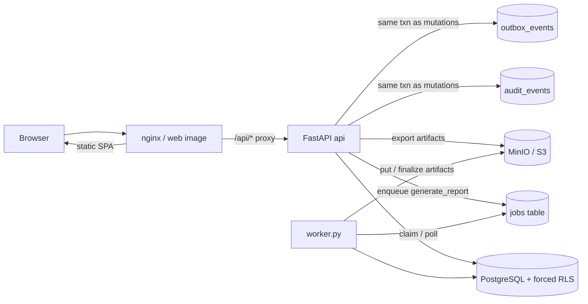
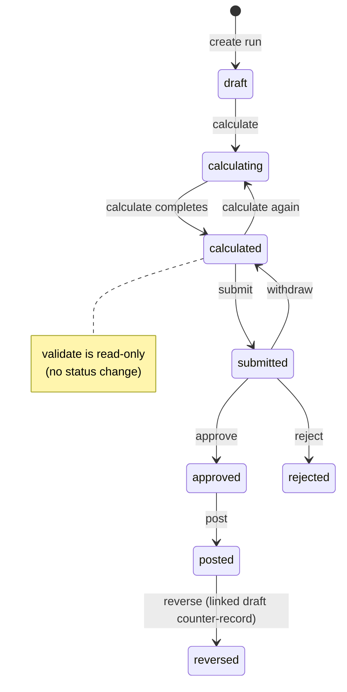

# Accord architecture

This page maps the running parts of Accord and how a payroll run moves
through them. It is written for people who are new to the project. Normative
decisions live in the ADRs under [`adr/`](adr/) (an ADR is an Architecture
Decision Record). This page only summarizes verified code paths, and it
calls out the places where the code differs from the ADR text.

---

## Component diagram

Accord runs as a small set of services. A browser talks to an nginx web
server. That server serves the built frontend and proxies API calls to the
FastAPI backend. The backend talks to PostgreSQL and to S3-compatible object
storage (MinIO when self-hosted). A separate worker process handles slow
jobs, such as report generation.



- **web**: `deploy/Dockerfile.web` builds the frontend and serves it through
  `deploy/nginx/nginx.conf` (static files plus the `/api` proxy).
- **api**: `backend/app/main.py`, run with uvicorn; Compose service `api`.
- **worker**: `backend/worker.py` (started as `python worker.py`); Compose
  service `worker`. It polls the PostgreSQL `jobs` table for work (ADR 0010).
- **audit / outbox**: the API writes an append-only audit event and an outbox
  event in the same database transaction as posting and other mutating
  commands (ADR 0009). See `backend/app/services/run_posting.py`.

---

## Pay-run command workflow (as implemented)

A payroll run moves through a fixed set of statuses. The persisted statuses
(from the `run_workflow.py` module docstring and the services) are:
`draft`, `calculating`, `calculated`, `submitted`, `approved`, `rejected`,
`posted`, `reversed`.



| Command | Module | Transition |
| --- | --- | --- |
| `calculate` | `services/run_calculation/` (`command.py`) | `draft`\|`calculated` → `calculating` → `calculated` |
| `validate` | `services/run_workflow.py` | read against `calculated` only; no status change |
| `submit` | `services/run_workflow.py` | `calculated` → `submitted` |
| `withdraw` | `services/run_workflow.py` | `submitted` → `calculated` |
| `approve` / `reject` | `services/run_workflow.py` | `submitted` → `approved` / `rejected` |
| `post` | `services/run_posting.py` | `approved` → `posted` (+ audit + outbox) |
| `reverse` | `services/run_posting.py` | `posted` → `reversed`; creates a linked `draft` counter-record |

**Discrepancies vs ADR 0008 (do not paper over):**

- The ADR lists statuses `validated` and `withdrawn`; the code has neither.
  Validate does not set a status; withdraw lands on `calculated`.
- The ADR allows `calculate` from `rejected`; the code allows only `draft`
  and `calculated` (`_ALLOWED_CALCULATE_STATUSES` in
  `services/run_calculation/command.py`).
- The ADR allows `withdraw` from `approved`; the code allows only `submitted`.
- The code adds a transient `calculating` status during calculate. That
  status is not in the ADR's closed set.

---

## Service layer layout

The two largest services are packages, not single files. Each package splits
one workflow along its natural seams.

`backend/app/services/run_calculation/` owns the `calculate` command:

- `_convert.py` — pure converters between database rows, domain values, and
  snapshot payloads. No database access.
- `resolution.py` — resolves effective-dated master data into typed engine
  inputs. Lookups are batched to avoid per-employee queries.
- `snapshots.py` — builds the immutable report snapshots stored on the run
  version (ADR 0007).
- `command.py` — the orchestrating `calculate_run_command`.

Only `calculate_run_command` is public service API; the other modules are
internal to the package.

`backend/app/services/pay_setup/` owns pay-setup master data, with one
module per aggregate: `components.py`, `recurring.py`, `advances.py`,
`accommodation.py`, and `report_config.py`. Shared plumbing lives in
`_shared.py`.

Three shared modules keep cross-cutting rules in one place:

- `backend/app/services/versioning.py` — effective-dated version helpers,
  including `terminate_open_version` (ADR 0005).
- `backend/app/services/db_errors.py` — the one canonical mapping from
  database `IntegrityError` to Accord's HTTP error taxonomy.
- `backend/app/schemas/money.py` — the `MoneyAmount` and `RateValue` wire
  types. Money crosses the API as a decimal string, never a float (ADR 0006).

---

## Request tenancy flow

Product contract: one organization per deployment
([ADR 0011](adr/0011-single-organization.md)). `GET /api/auth/me` exposes
`access_state` plus a singular `organization` / `membership`. Bootstrap is
ops CLI only (`scripts/provision_organization.py`). The session
`active_organization_id`, the `organization_id` columns, and the forced RLS
GUCs remain **kernel debt** until Phase 2 removes them. They are not a
multi-org product surface.

Two terms first. RLS is PostgreSQL row-level security: the database itself
filters rows per organization, and "forced" means even the table owner
cannot skip it. A GUC is a PostgreSQL session setting; Accord uses GUCs to
tell the database which organization and user a transaction acts for.

Verified against `backend/app/api/deps.py`, `backend/app/tenancy.py`,
`backend/app/services/identity.py`, ADR 0001, and ADR 0004, each request
passes four steps:

1. **Session** — a WorkOS-backed session cookie establishes the principal
   (`get_current_user` → `AuthPrincipal` with an optional
   `active_organization_id`).
2. **Membership** — `require_tenant_context` requires an active org on the
   principal, loads the user, then `resolve_active_organization` re-checks
   membership under RLS.
3. **SET LOCAL** — before the membership re-check, `bind_tenant_context`
   issues `set_config(..., is_local=true)` for `app.organization_id`,
   `app.user_id`, and the optional `app.request_id`. These settings are
   transaction-local, so they are safe with asyncpg connection pooling.
4. **RLS** — tenant tables use forced row-level security keyed on those GUCs
   (ADR 0001). Missing context fails closed: no context means zero rows.

Workers bind org context after claiming a job (`app/jobs/worker.py` →
`bind_tenant_context`).

---

## Report pipeline

Verified against `backend/app/reports/`,
`backend/app/services/report_generation.py`,
`backend/app/services/artifacts.py`, and
`backend/app/api/routes/artifacts.py`, a report moves through six steps:

1. **Registry** — `reports/registry_setup.py` `build_report_registry()`
   registers all first-release families (payroll register, payments,
   retirement, statutory, recovery, approval note; see `reports/families/`).
2. **Request** — the API enqueues a `generate_report` job via
   `request_report` (org-scoped in-flight dedupe on type/run/format/template).
3. **Builder** — the worker handler `execute_generate_report` runs the
   registered builder against a **posted** run snapshot and produces a
   `ReportDTO`. The shared posted-run loading lives in
   `reports/posted_run.py`, so gating and loading semantics cannot drift
   between families.
4. **Formatter** — `to_json` / `to_excel` / `to_pdf` on the registration.
5. **Artifact** — `create_artifact` writes a pending row, puts the bytes in
   object storage, then finalizes the `ExportArtifact`. It may reuse an
   existing finalized artifact.
6. **Download** — `GET /api/artifacts/{id}/download` streams the bytes
   through the API with org and capability checks (`artifacts.py`).

Reports never re-resolve "current" master data. They read the pinned
versions captured at post time (see
[`report-specs/report-catalog.md`](report-specs/report-catalog.md)).

---

## ADR index (one-line each)

| ADR | Summary |
| --- | --- |
| [0001](adr/0001-tenancy-rls-database-roles.md) | Forced RLS, DB roles (`accord_migrator` / `accord_app` / `accord_worker`), GUC tenant context |
| [0002](adr/0002-workos-authentication-sessions.md) | WorkOS auth, sessions, capabilities |
| [0003](adr/0003-backend-bootstrap-environment.md) | Backend bootstrap and environment settings matrix |
| [0004](adr/0004-organization-url-session-context.md) | Active org on session/URL; central SET LOCAL binding |
| [0005](adr/0005-effective-dated-master-data.md) | Effective-dated master versions; pin on post |
| [0006](adr/0006-money-decimal-rounding.md) | Decimal money; no float in payroll domain |
| [0007](adr/0007-payroll-run-calculation-model.md) | Immutable calculated run versions + engine inputs |
| [0008](adr/0008-command-workflow-idempotency.md) | Command workflow, maker/checker, idempotency |
| [0009](adr/0009-audit-outbox.md) | Append-only audit events + transactional outbox |
| [0010](adr/0010-jobs-object-storage.md) | Durable jobs queue + S3-compatible export artifacts |
| [0011](adr/0011-single-organization.md) | Single-organization product contract; CLI bootstrap; kernel debt |

---

## Repository directory map (top two levels)

```
accord/
├── .github/workflows/     # ci.yml, deploy.yml
├── backend/
│   ├── app/               # FastAPI app, domain, jobs, reports, services
│   ├── migrations/        # Alembic env + versions
│   ├── scripts/           # create_roles.sql, export_openapi.py
│   ├── tests/
│   ├── alembic.ini
│   ├── Dockerfile
│   ├── requirements.txt
│   ├── requirements-dev.txt
│   └── worker.py          # durable-job worker entrypoint
├── frontend/
│   ├── src/               # React app (pages, components, lib)
│   ├── public/
│   ├── scripts/
│   └── package.json
├── deploy/
│   ├── docker-compose.yml
│   ├── Dockerfile.web
│   ├── nginx/
│   └── object-storage/    # MinIO bucket init
├── docs/
│   ├── adr/               # ADR 0001–0011
│   ├── report-specs/
│   └── *.md               # domain, security, testing, …
├── fixtures/sanitized/    # synthetic fixtures only
├── scripts/               # start/stop/status/verify/smoke-test/…
├── package.json           # pnpm workspace root
└── README.md
```

Two notes on the frontend layout, since they trip up people who knew the old
tree. The API client modules under `frontend/src/lib/api/` are split by
concern: `pay-setup.ts` (org-level pay setup) is separate from
`employee-payroll-setup.ts` (per-employee setup), and `payroll-runs.ts` (run
CRUD) is separate from `payroll-run-workflow.ts` (workflow commands).
Display-only formatting helpers live in `frontend/src/lib/payroll-display.ts`.
MSW test fixtures (mock API handlers for Vitest) live under
`frontend/src/test/msw/`.
